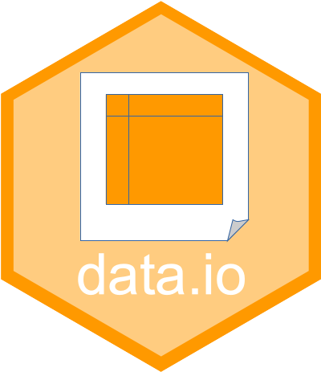

<!-- README.md is generated from README.Rmd. Please edit that file -->

```{r, include=FALSE}
knitr::opts_chunk$set(collapse = TRUE, comment = "#>",
  fig.path = "man/figures/README-", out.width = "100%")
```

# 'SciViews::R' - Read and Write Data in Different Formats <a href="https://www.sciviews.org/data.io"></a>

<!-- badges: start -->
[](https://github.com/SciViews/data.io/actions/workflows/R-CMD-check.yaml)
[](https://codecov.io/gh/SciViews/data.io)
[](https://cran.r-project.org/package=data.io)
[](https://sciviews.r-universe.dev/data.io)
[](https://opensource.org/licenses/MIT)
[](https://lifecycle.r-lib.org/articles/stages.html#stable))
<!-- badges: end -->

{data.io} main functions are `read()` and `write()`. They are made super-easy to import and export data in various formats in an unified way (they use functions from other packages under the hood like {haven}, {readr}, {readxl}, {writexl} ...). They care about metadata, in particular, meaningful labels and units for the variables. Also, a mechanism to preprocess data sets using sidecar files, and to translate them into various languages are provided for a subset of R packages data sets.

## Installation

{data.io} is not available from CRAN yet. You should install it from the [SciViews R-Universe](https://sciviews.r-universe.dev). To install this package and its dependencies, run the following command in R:

```{r, eval=FALSE}
install.packages('data.io', repos = c('https://sciviews.r-universe.dev',
  'https://cloud.r-project.org'))
```

You can also install the latest development version. Make sure you have the {remotes} R package installed:

``` r
install.packages("remotes")
```

Use `install_github()` to install the {data.io} package from Github (source from **main** branch will be recompiled on your machine):

``` r
remotes::install_github("SciViews/data.io")
```

R should install all required dependencies automatically, and then it should compile and install {data.io}.

## Further explore {data.io}

You can get further help about this package this way. Make the {data.io} package available in your R session:

``` r
library("data.io")
```

Get help about this package:

``` r
library(help = "data.io")
help("data.io-package")
vignette("data-io") # None is installed with install_github()
```

For further instructions, please, refer to these help pages at <https://www.sciviews.org/data.io/>.

## Code of Conduct

Please note that the {data.io} package is released with a [Contributor Code of Conduct](https://contributor-covenant.org/version/2/1/CODE_OF_CONDUCT.html). By contributing to this project, you agree to abide by its terms.
